<h1 align="center">Layered Device Parts</h1>

<p align="center">
  An AI agent pipeline that turns <b>one picture of a gadget</b> into a
  <b>layered 2D game asset</b> — a packed atlas plus a JSON assembly you can
  take apart, repair and put back together.
</p>

<p align="center">
  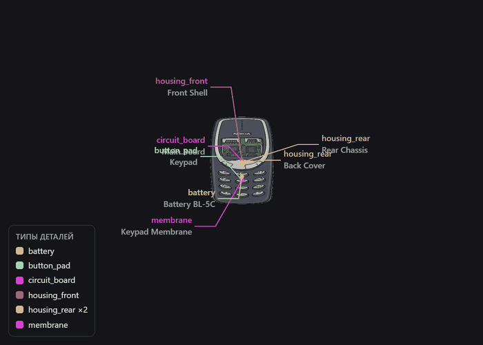
</p>

<p align="center">
  <sub>Real frames from the project's own viewer. Type schema on, layers pulling apart and back together.</sub>
</p>

---

## What it makes

Games about taking things apart need a device modelled as a **stack of layers**,
not as one flat sprite: front shell → keypad → membrane → board → battery →
rear chassis → back cover. Every layer has to be its own sprite, sit at its own
position, and stack back into a device that looks untouched.

Feed the pipeline a reference picture. It gives back:

| File | What it is |
|---|---|
| `texture.png` | Every part packed into one atlas, transparent background |
| `device.json` | Part list: atlas frame, scene position, size, rotation, layer, type |
| `preview_flat.png` | The parts stacked — should be indistinguishable from the source device |
| `preview_exploded.png` | The same parts pulled apart |
| `ОТКРЫТЬ_<device>.html` | Standalone viewer with the asset baked in — double-click, no server |
| `viewer.html` | The same viewer, empty — drop any other asset onto it |

<p align="center">
  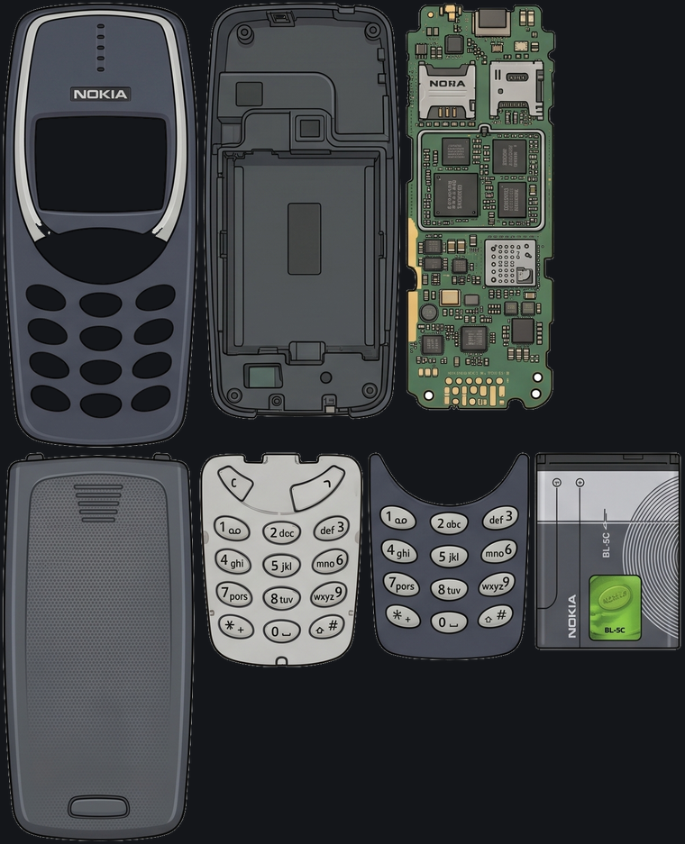
</p>

### The format

```json
{
  "device": "nokia_3310",
  "texture": "texture.png",
  "texture_size": [1279, 1577],
  "canvas": [595, 1336],
  "parts": [
    {
      "id": "back_cover",
      "name": "Back Cover",
      "type": "housing_rear",
      "frame":    { "x": 3, "y": 844, "w": 362, "h": 730 },
      "position": [300.0, 570.0],
      "size":     [362.0, 730.0],
      "rotation": 0.0,
      "layer": 0
    }
  ]
}
```

`frame` crops the part out of the atlas, `position` places it on the canvas,
`layer` decides teardown order — layer 0 comes off last. `type` is a shared
classification (`housing_front`, `circuit_board`, `battery`, `display`, …) so a
game can treat every battery in every device the same way. The 22 types live in
[`ТИПЫ_ДЕТАЛЕЙ.md`](ТИПЫ_ДЕТАЛЕЙ.md).

---

## Gallery

**22 devices, 265 parts** built so far — phones, handhelds, cameras, players.

<p align="center">
  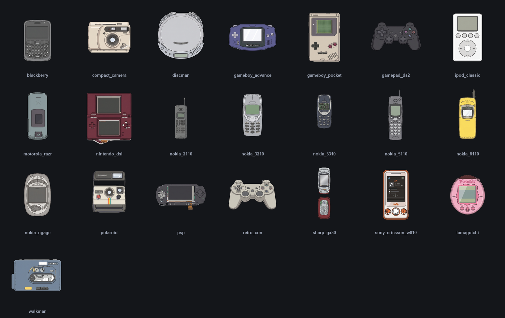
</p>

<p align="center">
  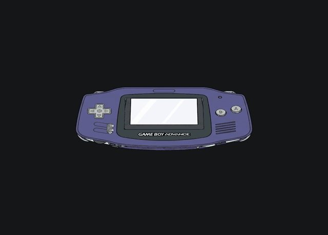
</p>

---

## How it works

Three local MCP servers, one agent orchestrating them across 13 steps. The only
step that leaves the machine is image generation, which drives a real Chrome
window signed into Google Flow.


| # | Step | What happens |
|---|---|---|
| 1 | Check Flow | Debug Chrome up, project tab open, user signed in |
| 2 | Exploded diagram | Device → isometric layer diagram, 4 candidates |
| 3 | Pick a diagram | All four looked at by eye, best one taken |
| 4 | Parts layout | Diagram → flat layout, every part face-on |
| 5 | Background removal | White background → alpha, interior white kept |
| 6 | Punch holes | Map of white blobs → picked by eye → cleared |
| 7 | Extract parts | Connected regions → separate PNGs + contact sheet |
| 8 | Pick parts | Full set chosen off the contact sheet, junk dropped |
| 9 | Punch part cutouts | Through-holes in shells |
| 10 | Trim the fringe | 2 px shaved off every alpha border |
| 11 | Pack the atlas | Parts → `texture.png` + `device.json` |
| 12 | Assemble | Render → nudge positions → render, until it reads as one device |
| 13 | Package | Validate, build the asset folder and the standalone viewer |

Three checkpoints are **looked at by a human-grade eye, not by a metric**:
picking the best generation, picking parts off the contact sheet, and approving
the final assembly. An asset that has not been looked at does not ship.

### The MCP servers

| Server | Tools | Runs |
|---|---|---|
| `flow-images` | `flow_check`, `flow_setup`, `flow_generate`, `flow_paste_reference`, `flow_list_files` | Real Chrome over CDP, Google Flow |
| `bg-remover` | `bg_check`, `bg_remove`, `bg_inspect`, `bg_punch`, `bg_shrink`, `bg_install_ai` | Local (Pillow / NumPy / SciPy) |
| `asset-builder` | `asset_extract`, `asset_punch`, `asset_pack`, `asset_render`, `asset_update`, `asset_validate`, `asset_viewer`, `asset_package` | Local |

---

## The viewer

Every asset ships with a viewer that is also an editor. No build step, no
server — the asset is base64'd into the HTML, so `ОТКРЫТЬ_<device>.html` opens
straight off the disk.

<p align="center">
  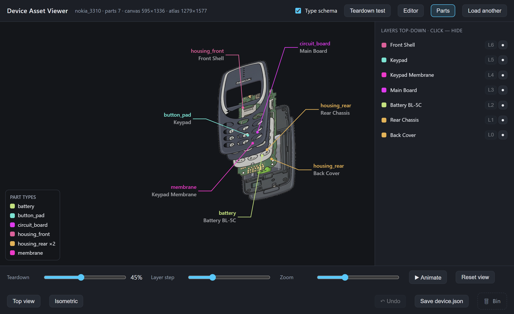
</p>

- **Explode slider** — pull the stack apart and back, orbit it, top view or isometric.
- **Type schema** — leader lines with each part's type and name; one colour per type, derived from a hash of the type name.
- **Editor** — reorder layers, delete parts, retype them, drag parts around the scene or nudge them with arrow keys, Ctrl+Z, then save `device.json` back to the file it came from.
- **Teardown test** — flat top view where you grab parts with the mouse and pull them off like puzzle pieces, with a "N of M removed" counter. It never touches the asset; offsets live separately and reset when you leave.

---

## Pipeline dashboard

A local page on `127.0.0.1:7788` that mirrors the run: every tool call lands in
an event log, the server sorts it into the 13 steps and builds a gallery of
every image that was generated, cut or inspected.

<p align="center">
  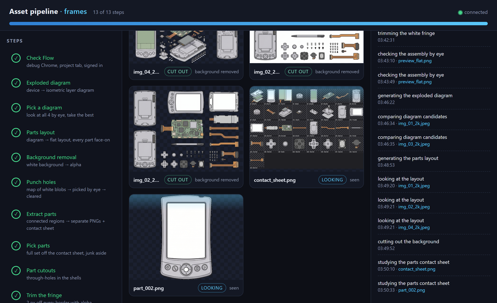
</p>

It is a mirror and nothing more — the pipeline does not wait on it and does not
break without it.

```bash
py "Pipeline Dashboard/server.py" --ensure --open   # start if not running, open a tab
py "Pipeline Dashboard/server.py" --status          # is it alive?
```

---

## Parts library

Every piece the cutter has ever produced is kept — **1413 parts** so far,
whether it made it into an atlas or not. Before generating a missing part, the
agent checks the library first: the shell, board or screen it needs has often
already been cut from a neighbouring device.

```bash
py "Библиотека деталей/library.py" stats     # counts per device
py "Библиотека деталей/library.py" scan      # re-walk work/ and assets/
py "Библиотека деталей/library.py" sheet     # rebuild the contact sheets
```

Two folders (used / unused), a flat `index.json` registry, and contact sheets of
96 parts each. It is maintained by a hook — nothing is copied by hand.

---

## Unity import

`Unity/Editor/DeviceAssetImporter.cs` — drop it into an `Editor/` folder and
open **Tools → Device Asset Importer**. Point it at a `device.json` + atlas and
it slices every part into its own sprite, then builds the scene hierarchy: one
empty object per device, a `SpriteRenderer` per layer, positioned from the JSON
and spaced along Z in teardown order.

---

## Getting started

**Requirements**

- Windows, Python 3.12 (invoked as `py`)
- `pillow`, `numpy`, `scipy`, `mcp` — background removal and asset building
- `playwright` — Flow automation and media capture (uses your installed Chrome, no browser download)
- A Google Flow account, for the generation steps only

**Install**

```bash
py -m pip install -r "BG Remover MCP/requirements.txt"
py -m pip install -r "Image Geneartor MCP/requirements.txt"
```

Register the three MCP servers with Claude Code — each server folder has an
`install.bat`, and `Image Geneartor MCP/mcp-config-example.json` shows the manual
form.

**Run**

Hand the agent a picture of a device and ask for an asset. It follows the
`device-asset-pipeline` skill in `.claude/skills/`, which carries the full
step-by-step procedure, the selection criteria and the JSON contract.

Nothing to hand it? It draws its own reference: the prompts in `Promts/` generate
a sheet of devices, the best one gets cropped to a square, and that square
becomes the style anchor for everything downstream.

---

## Repository layout

```
Image Geneartor MCP/     image generation through a live Chrome on Google Flow
BG Remover MCP/          background removal → transparent PNG (local)
Asset Builder MCP/       part cutting, atlas packing, assembly, viewer
Pipeline Dashboard/      live progress panel
Promts/                  pipeline prompts (edited by hand, read fresh every run)
Библиотека деталей/       every part ever cut, used and unused
work/<device>/           pipeline intermediates (not tracked — rebuildable)
assets/<device>/         finished assets: texture.png + device.json + previews
Unity/                   Unity editor importer
docs/                    README media and the scripts that generate it
ТИПЫ_ДЕТАЛЕЙ.md          the shared part-type registry
```

---

## Regenerating this README's media

Both scripts drive the project's real viewer in headless Chrome, so the images
here can never drift from what the tool actually renders.

```bash
# animated teardown loops
py "Asset Builder MCP/make_gif.py" nokia_3310
py "Asset Builder MCP/make_gif.py" gameboy_advance --no-schema --colors 64 --frames 40 --delay 90 --width 560 --height 420

# the device gallery, and the animated wall at the bottom of this page
py "Asset Builder MCP/make_gif.py" --all --grid
py "Asset Builder MCP/make_gif.py" --all --no-schema --frames 24 --delay 100 --colors 48 \
    --width 240 --height 240 --travel 190 --margin-w 0.92 --margin-h 0.92 --out docs/media/tiles

# viewer, dashboard and atlas stills
py docs/shots.py
```

The loop is seamless by construction: the swing is `sin(2πt)` and the teardown
is `(1 − cos(2πt)) / 2`, so the last frame meets the first. Framing is measured,
not guessed — the recorder poses the asset fully exploded at both ends of the
swing, reads its on-screen bounding box back out of the page, and picks the
scale from that, so a 14-layer console frames as well as a 6-layer phone.

Type callouts still trail their parts on the recording, the way they do live.
They run on a virtual clock stepped by the frame delay rather than by
`requestAnimationFrame` — that is what made screenshot timing decide the phase.
Since a trailing callout depends on the frames before it, the recorder runs one
silent lap first so the lag settles into its cycle before capture starts.

---

## Notes

- Code comments, prompts and in-app text are in Russian — that is the project's
  working language. This README is the English entry point.
- Flow generations are a finite resource. The agent is instructed not to re-roll
  on a hunch: at most two retries, and only with a stated reason.
- `assets/nokia_3310/` is the reference asset — 7 layers, built end to end
  through this pipeline. Use it as the shape of `device.json` and as a test file
  for the viewer.

---

## Every device, coming apart

All 22 assets on the same loop: assembled, layers pulled apart in teardown
order, back together. Same recorder, same viewer, 24 frames each.

<table>
  <tr>
    <td align="center" width="16.6%">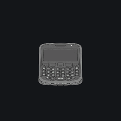</td>
    <td align="center" width="16.6%">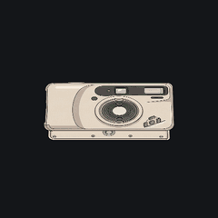</td>
    <td align="center" width="16.6%">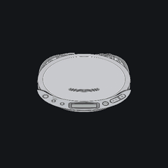</td>
    <td align="center" width="16.6%">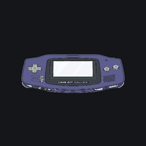</td>
    <td align="center" width="16.6%">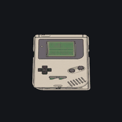</td>
    <td align="center" width="16.6%">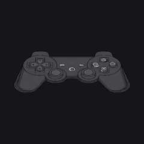</td>
  </tr>
  <tr>
    <td align="center"><sub><b>blackberry</b></sub></td>
    <td align="center"><sub><b>compact_camera</b></sub></td>
    <td align="center"><sub><b>discman</b></sub></td>
    <td align="center"><sub><b>gameboy_advance</b></sub></td>
    <td align="center"><sub><b>gameboy_pocket</b></sub></td>
    <td align="center"><sub><b>gamepad_ds2</b></sub></td>
  </tr>
  <tr>
    <td align="center" width="16.6%">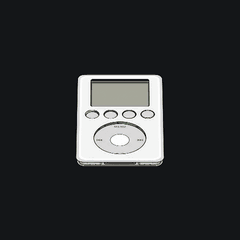</td>
    <td align="center" width="16.6%">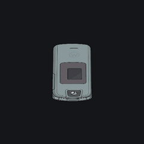</td>
    <td align="center" width="16.6%">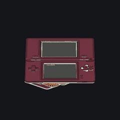</td>
    <td align="center" width="16.6%">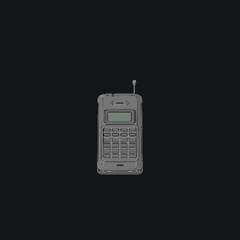</td>
    <td align="center" width="16.6%">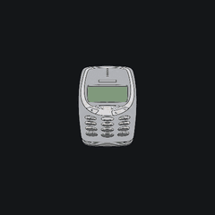</td>
    <td align="center" width="16.6%">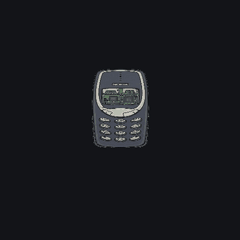</td>
  </tr>
  <tr>
    <td align="center"><sub><b>ipod_classic</b></sub></td>
    <td align="center"><sub><b>motorola_razr</b></sub></td>
    <td align="center"><sub><b>nintendo_dsi</b></sub></td>
    <td align="center"><sub><b>nokia_2110</b></sub></td>
    <td align="center"><sub><b>nokia_3210</b></sub></td>
    <td align="center"><sub><b>nokia_3310</b></sub></td>
  </tr>
  <tr>
    <td align="center" width="16.6%">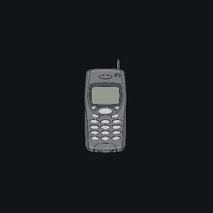</td>
    <td align="center" width="16.6%">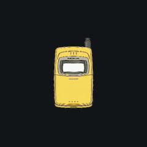</td>
    <td align="center" width="16.6%">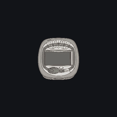</td>
    <td align="center" width="16.6%">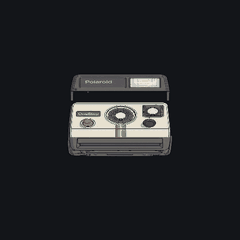</td>
    <td align="center" width="16.6%">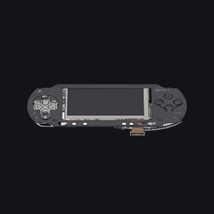</td>
    <td align="center" width="16.6%">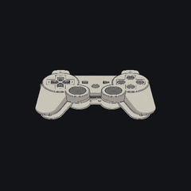</td>
  </tr>
  <tr>
    <td align="center"><sub><b>nokia_5110</b></sub></td>
    <td align="center"><sub><b>nokia_8110</b></sub></td>
    <td align="center"><sub><b>nokia_ngage</b></sub></td>
    <td align="center"><sub><b>polaroid</b></sub></td>
    <td align="center"><sub><b>psp</b></sub></td>
    <td align="center"><sub><b>retro_con</b></sub></td>
  </tr>
  <tr>
    <td align="center" width="16.6%">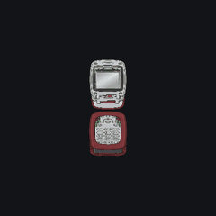</td>
    <td align="center" width="16.6%">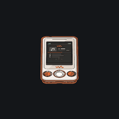</td>
    <td align="center" width="16.6%">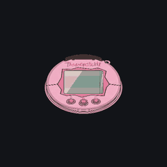</td>
    <td align="center" width="16.6%">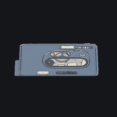</td>
  </tr>
  <tr>
    <td align="center"><sub><b>sharp_gx30</b></sub></td>
    <td align="center"><sub><b>sony_ericsson_w810</b></sub></td>
    <td align="center"><sub><b>tamagotchi</b></sub></td>
    <td align="center"><sub><b>walkman</b></sub></td>
  </tr>
</table>

<p align="center">
  <sub>Rebuild the whole wall with<br>
  <code>py "Asset Builder MCP/make_gif.py" --all --no-schema --frames 24 --delay 100 --colors 48 --width 240 --height 240 --travel 190 --margin-w 0.92 --margin-h 0.92 --out docs/media/tiles</code></sub>
</p>
